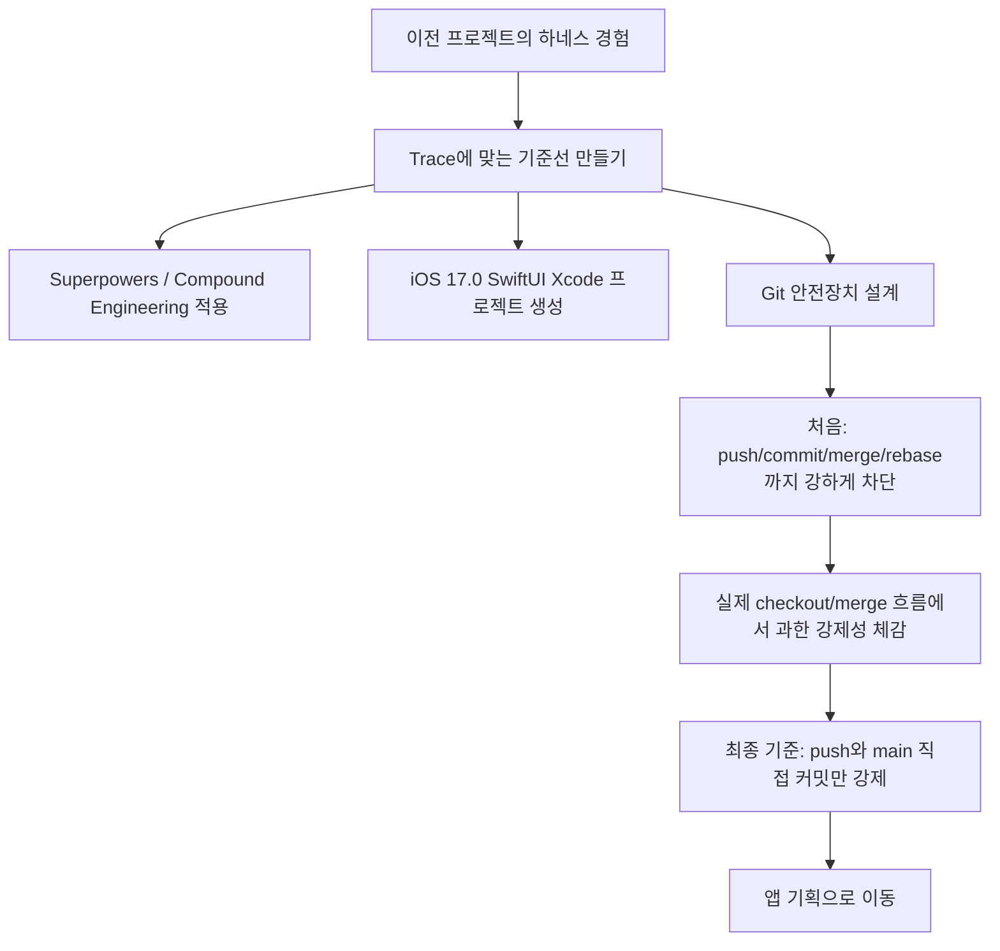

# 260616 Daily Retro

## 오늘 뭘 했나

오늘은 실제 앱 기능을 만들기보다, Trace라는 새 iOS 앱을 시작하기 전에 개발 환경과 에이전트 작업 흐름을 정리했다. 이전에는 Claude Code에서 바이브 코딩을 하면서 멘토에게 받은 하네스 엔지니어링 자료와 이미 어느 정도 세팅된 환경을 바탕으로 프로젝트를 진행했었다. 이번에는 새 앱을 시작하면서, 그때의 설정을 그대로 복사하기보다 지금 프로젝트에 맞게 다시 조립해보려고 했다.

처음에는 Superpowers, Compound Engineering, Build iOS Apps, XcodeBuildMCP 같은 도구를 깔고, iOS 17.0+, SwiftUI, MVVM, Clean Architecture 방향의 규칙을 정리했다. 그리고 `/trace-init`, `/daily-retro`, compact/history 설정처럼 세션이 끊겨도 다시 이어갈 수 있는 장치도 마련했다. 이 과정은 앱 기획 전에 "작업을 안전하게 시작할 수 있는 바닥"을 만드는 일에 가까웠다.

오후에는 Xcode 기본 프로젝트를 만들고, 잘못 중첩된 구조를 repo 루트 기준으로 정리했다. `Trace.xcodeproj`, `Trace/`, `TraceTests/`, `TraceUITests/`가 루트에 오도록 맞췄고, Xcode가 만든 iOS 26.5 배포 타깃을 프로젝트 규칙에 맞게 iOS 17.0으로 낮췄다. 이후 빌드, 테스트, SwiftLint를 돌려 기본 프로젝트가 동작하는지 확인했다.

마지막으로 가장 오래 잡았던 부분은 Git 안전장치였다. 처음에는 push, commit, merge, rebase까지 넓게 막으려 했지만, 실제로 checkout과 merge 흐름에서 불편함이 생겼다. 그래서 "진짜 위험한 지점은 원격으로 나가는 push와 main 직접 커밋"이라는 기준으로 다시 정리했다. 현재는 push는 사용자가 `ALLOW_PUSH=1 git push ...`로 직접 하도록 막고, main 직접 커밋은 pre-commit으로 막는 방향이 더 현실적이라고 판단했다.

## 핵심 의사결정과 이유

### 1. 하네스를 처음부터 만들지 않고 범용 도구 위에서 시작하기

상황: 이전 프로젝트에서는 멘토가 준 하네스 엔지니어링 자료와 세팅을 많이 활용했다. 이번 프로젝트에서도 비슷한 안전장치가 필요했지만, 그대로 복사하면 Trace에 맞지 않는 규칙까지 딸려올 수 있었다.

선택지: 직접 하네스를 처음부터 구현하거나, 이전 프로젝트 세팅을 거의 그대로 가져오거나, 이미 널리 쓰이는 Superpowers와 Compound Engineering을 바탕으로 시작할 수 있었다.

결정: 범용적으로 알려진 도구를 먼저 적용하고, Trace를 진행하면서 맞지 않는 부분을 덜어내기로 했다.

왜: 하네스 엔지니어링을 직접 충분히 구현해본 상태는 아니기 때문에, 처음부터 완벽한 체계를 만드는 것보다 검증된 도구를 바탕으로 시작하는 편이 낫다고 봤다. 대신 프로젝트마다 하네스는 변형되어야 하므로, 가져온 규칙을 고정된 정답처럼 다루지는 않기로 했다.

인사이트: 좋은 하네스는 한 번 만들고 끝나는 템플릿이 아니라, 프로젝트가 진행되면서 계속 조정되는 작업 방식에 가깝다.

### 2. 완벽한 세팅보다 시작 가능한 기준선을 우선하기

상황: 앱 기획도 시작하기 전에 너무 많은 설정을 하다 보면, 오히려 아무것도 시작하지 못할 수 있다는 느낌이 있었다. 실제로 Git 규칙과 훅을 조정하면서 "이게 완벽한가?"라는 질문이 계속 생겼다.

선택지: 완벽하다고 느낄 때까지 계속 세팅하거나, 최소한의 안전 기준만 잡고 앱 기획으로 넘어갈 수 있었다.

결정: 일단 시작 가능한 기준선을 만들고, 실제 작업 중 불편하거나 위험한 부분이 드러나면 수정하기로 했다.

왜: 아직 실제 앱 코드가 거의 없기 때문에 지금 모든 구조와 규칙이 맞는지 판단할 수 없다. 프로젝트 구조도, 폴더 구성도, 하네스 강도도 실제 기능이 들어가야 더 정확히 보인다.

인사이트: 완벽한 세팅은 없다. 세팅은 앱을 만들기 위한 준비이지, 앱 만들기를 미루는 이유가 되면 안 된다.

### 3. Git에서 가장 강하게 막을 지점을 push와 main 직접 커밋으로 좁히기

상황: 처음에는 Git을 잘 모른다는 불안 때문에 commit, push, merge, rebase를 모두 강하게 막으려 했다. 하지만 실제로 main으로 체크아웃하거나 작업 브랜치를 통합하려는 순간, 과한 훅이 정상 흐름까지 헷갈리게 만들었다.

선택지: 모든 Git 위험 동작을 훅으로 막거나, 아무것도 막지 않거나, 정말 위험한 지점만 막을 수 있었다.

결정: push는 사용자가 직접 하게 강제하고, main 직접 커밋은 막되, merge와 rebase는 문서 가이드로 낮추는 방향으로 정리했다.

왜: 커밋은 로컬 기록이라 다시 수정할 여지가 있지만, push는 원격에 영향을 준다. main 직접 커밋도 히스토리를 흐리게 만들 수 있다. 반면 작업 브랜치를 main 위로 rebase하고 fast-forward merge하는 흐름은 정상적인 개발 흐름이므로, 훅으로 너무 세게 막으면 오히려 작업을 방해한다.

인사이트: 안전장치는 많을수록 좋은 게 아니라, 위험한 경계에 정확히 걸려 있어야 한다. 오늘은 그 경계가 조금 더 선명해졌다.

### 4. Xcode 기본 프로젝트로 시작하고 모듈화는 나중에 판단하기

상황: Tuist를 쓸 수도 있었지만, 아직 앱 기획도 구체화되지 않은 상태였다. 구조를 너무 일찍 복잡하게 만들면 실제 앱보다 도구 설정에 더 많은 시간을 쓸 수 있었다.

선택지: Tuist나 XcodeGen을 도입하거나, Xcode 기본 프로젝트로 시작할 수 있었다.

결정: Xcode 기본 프로젝트로 시작했다.

왜: 지금은 모듈화가 필요한지 판단할 만큼 기능이 없다. SwiftUI 기본 앱 구조로 시작하고, 나중에 기능이 커지고 모듈 경계가 보이면 그때 Tuist나 Swift Package 분리를 검토하는 편이 현실적이다.

인사이트: 구조는 예상으로 크게 잡는 것보다, 실제 복잡도가 생겼을 때 분리하는 편이 더 안전할 수 있다.

## 기획/설계 과정

오늘 설계한 것은 앱의 화면이나 기능보다, 앱을 만들기 위한 작업 방식이었다. 이전 프로젝트에서 이미 하네스 엔지니어링을 경험했지만, 이번에는 "왜 이 규칙이 필요한가"를 다시 확인하면서 정리했다.

처음에는 이전에 쓰던 규칙을 기억에 의존해 꺼내왔고, 그 결과 Git 훅이 다소 과해졌다. 하지만 실제로 main으로 이동하고 브랜치를 합치는 과정에서 불편함이 드러났다. 그 덕분에 Git 안전 규칙의 목적을 다시 구분하게 됐다. 내가 막고 싶은 것은 에이전트가 마음대로 원격에 push하는 것이고, main에서 직접 커밋하는 것이다. merge와 rebase는 작업 흐름의 일부이므로, 무조건 차단보다 명확한 가이드가 더 적절하다.

Xcode 프로젝트 구조도 마찬가지였다. 지금은 기본 구조가 맞는지 완전히 판단할 수 없다. 실제 앱 기획이 들어가고, 기능별 코드가 생기고, 서비스와 모델이 만들어져야 구조가 보일 것이다. 그래서 오늘은 최소한 빌드 가능한 iOS 17.0 SwiftUI 프로젝트를 만들고, 나머지는 앱 기획 후 조정하기로 했다.

## 인사이트 & 피드백

오늘 가장 크게 느낀 것은, 세팅은 정답을 맞히는 문제가 아니라는 점이다. 이전 프로젝트에서 좋았던 하네스도 새 프로젝트에 그대로 들어오면 과할 수 있다. 반대로 처음에는 약해 보이는 규칙도 실제 작업을 하다 보면 충분할 수 있다.

특히 Git 규칙은 불안 때문에 과하게 막기 쉽다. 하지만 너무 많은 훅은 안전보다 혼란을 만들 수 있다. 오늘 checkout 실패 메시지를 보면서 이걸 체감했다. 실제 원인은 훅이 아니라 unstaged 변경이었지만, 이미 훅을 많이 넣어둔 상태라 "또 훅 때문인가?"라는 생각이 먼저 들었다. 이건 좋은 신호가 아니다. 안전장치는 문제가 생겼을 때 원인을 더 쉽게 찾게 해야지, 원인을 더 의심하게 만들면 안 된다.

앞으로 같은 상황이면 먼저 "정말 되돌릴 수 없는 위험이 어디인가?"를 구분해야겠다. Trace에서는 push와 main 직접 커밋이 그 지점이다. 나머지는 문서와 습관으로 관리하면서, 같은 문제가 두 번 이상 반복될 때 훅으로 올리는 방식이 맞다.

## 배운 것

- Codex 커스텀 프롬프트는 스킬과 다르다. `/trace-init`, `/daily-retro`는 세션 시작과 회고를 돕는 호출형 프롬프트다.
- Superpowers와 Compound Engineering은 그대로 믿고 끝나는 도구가 아니라, 프로젝트에 맞게 조정해야 하는 출발점이다.
- Xcode가 만든 기본 프로젝트도 repo 구조와 맞지 않을 수 있으므로, 프로젝트 생성 직후 구조 확인이 필요하다.
- Git 훅은 강력하지만, 너무 많이 걸면 정상 개발 흐름까지 의심하게 만든다.
- 로컬 커밋과 원격 push는 위험도가 다르다. 커밋은 조정 가능하지만, push는 외부 상태를 바꾸므로 더 강하게 보호해야 한다.

## 느낀 점

솔직히 오늘 세팅이 완벽하게 됐는지는 아직 모르겠다. 앱을 제대로 만들어본 것도 아니고, 실제 기능 코드가 들어간 것도 아니라서 지금 정한 규칙이 맞는지 확신하기는 어렵다. 그래도 이전 프로젝트에서 받은 세팅을 그대로 복붙하는 대신, 이번 프로젝트에 맞게 다시 생각해봤다는 점은 의미가 있었다.

제일 첫 세팅이 힘들다는 생각도 들었다. 앱 기능을 만드는 것보다, 그 전에 "어떻게 안전하게 만들 것인가"를 정하는 과정이 더 막막했다. 그래도 완벽한 세팅을 기다리면 아무것도 시작하지 못할 것 같다. 지금은 시작 가능한 정도의 안전한 바닥을 만들었고, 앞으로 실제 앱을 만들면서 나에게 맞게 계속 바꾸면 된다.

## 내일 할 일

내일 또는 다음 단계는 앱 기획을 시작하는 것이다. 이미 어느 정도 아이디어가 있으니, 이제 Trace가 어떤 문제를 풀 앱인지 구체화해야 한다.

우선 정해야 할 것은 다음과 같다.

- Trace가 해결하려는 문제
- 주요 사용자와 사용 상황
- 첫 번째 핵심 화면
- 데이터가 로컬 전용인지, 나중에 동기화가 필요한지
- 앱의 첫 MVP 범위

Git 쪽으로는 `chore/simplify-git-guards` 브랜치의 마지막 커밋을 main에 반영할지 확인하고, 최종적으로 사용자가 `ALLOW_PUSH=1 git push origin main`으로 원격에 올리면 된다.

## 인포그래픽

## 반복 실수 -> 기계화 제안

| 문제 유형 | 오늘 드러난 문제 | 반영 제안 |
|---|---|---|
| 워크플로우 이탈 | 하네스 규칙이 과해져 정상 Git 흐름까지 헷갈림 | `docs/agent-rules/git.md`는 "위험 경계만 훅으로 강제" 원칙 유지 |
| 반복적 실수 | 문자열 안의 `!`가 force unwrap으로 오탐됨 | 이미 `pre-commit` 훅 수정 완료 |
| 도구 부족 | 다음 세션에서 현재 상태 복원이 필요함 | `/trace-init` 사용 |
| 새 규칙 필요 | 앱 기획 전 결정이 흩어질 수 있음 | 기획 시작 시 `docs/agent-rules/project-decisions.md` 업데이트 |

원칙은 오늘 더 분명해졌다. 같은 문제가 두 번 나면 문서만 늘리지 말고, 정말 위험한 경우에만 hook이나 MCP 같은 기계적 장치로 올린다. 하지만 처음부터 모든 것을 기계화하지는 않는다.
