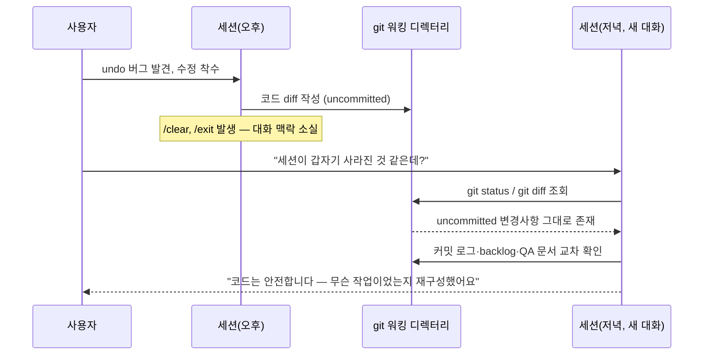

# 하루 회고 — 2026-07-01

MVP7 "코스 편집 UX 개선"을 설계부터 구현, 실기기 QA, 버그 수정, 아카이빙까지 하루 안에 끝낸 날.
중간에 세션이 한 번 끊기는 사고도 있었지만, 그것도 결국 배울 거리가 됐다.

---

## 오늘 뭘 했나

| 시각 | 커밋 | 내용 |
|---|---|---|
| 12:36 | `e6ab6f2` | 설계: 탭 자동 연결 + 구간 시각화 + 실시간 패널 |
| 12:45 | `348f776` | 설계 수정 — 그리기 모드 스트로크=세그먼트 통일 |
| 12:50~12:53 | `701e476`, `695d8d7` | 구현 계획 작성 + 어드바이저 2차 검토 반영 |
| 13:21 | `9698dea` | **탭 자동 연결** 구현 |
| 14:02 | `47e3dbf` | **그리기 스트로크=세그먼트** 통일 |
| 14:11 | `babc44e` | **색상 팔레트** 순환 도입 |
| 14:36 | `28075e3` | **지도 위 세그먼트별 색상+거리 라벨** 렌더링 |
| 15:10 | `2a76d93` | **실시간 구간 패널** + 지도 연동 |
| 15:29 | `8458f8d` | `selectedSegmentIndex` 무효화 버그 수정 |
| **15:29 ~ 19:59** | — | **세션 단절** (`/clear`·`/exit`) |
| 19:59 | `09b0ad8` | undo가 prepend된 구간을 못 지우는 버그 수정 |
| 20:01 | `1f1e71c` | (C) 짧은 거리 도착 마커 미표시 수정 |
| 20:17 | `0bb2b82` | (D) 내 위치 버튼 겹침 실패 수정 |
| 21:21 | `9376f98` | MVP7 완료 등록 + 아카이빙 |

오전~오후 초반은 설계·계획·구현 4개 마일스톤(탭 자동 연결, 그리기 통일, 색상, 패널)을 순서대로 밀어붙였고,
저녁에는 실기기 QA에서 나온 버그 3건(undo/prepend, 도착 마커, 위치 버튼)을 근본 원인부터 고쳤다. 마지막엔
MVP 전체를 정리하고 아카이빙까지 마쳤다.

---

## 핵심 의사결정과 이유

가장 큰 줄기는 하나였다: **"경로 전체를 하나의 덩어리로 보지 않고, 구간(세그먼트) 하나하나를 구별 가능한
단위로 만든다."** 오늘 만든 기능 4개(탭 자동 연결, 그리기 통일, 색상 팔레트, 지도 렌더링+패널)가 전부 이
목표를 향해 쌓였고, 저녁의 버그 수정도 이 구별 방식을 index 기반에서 identity 기반으로 다듬는 과정이었다.

### 상황 · 선택지 · 결정 · 왜

**상황:** 기존엔 그린/탭한 경로 전체가 하나의 좌표 배열이었다. 구간별로 색을 다르게 칠하거나, 패널에서
"몇 번째 구간이 몇 미터인지" 보여주려면 경로를 "구간 단위"로 쪼개서 다뤄야 했다.

**선택지:**
- A. 렌더링 레이어에서만 임의로 구간을 나눠 색을 입힌다 (좌표 배열을 일정 거리마다 잘라서).
- B. 애초에 데이터 모델(`CourseEditSession.segments`)이 "1 동작(탭/스트로크) = 1 세그먼트"가 되도록
  만들고, 그 배열을 그대로 렌더링·패널·undo 전부가 공유한다.

**결정:** B. 그리기 모드도 스트로크가 끝날 때마다 즉시 `attach()`하도록 통일해서, 탭이든 그리기든 "한 번의
사용자 동작 = 한 세그먼트"라는 계약을 데이터 모델 레벨에서 보장했다.

**왜:** A안은 렌더링에서만 구간을 나누기 때문에, undo나 패널 같은 다른 기능이 "진짜 구간"을 알 수 없다.
B안은 세그먼트가 도메인 개념으로 한 번 정해지면 색상·라벨·패널·undo가 전부 같은 배열을 공유해서 서로
어긋날 일이 없다.

**인사이트:** "구별"이 필요한 기능을 만들 때는 화면(렌더링)에서 임시로 나누지 말고, 데이터 모델에서 그
구별 단위를 먼저 확정하는 게 이후 모든 기능(색상, 패널, undo)의 일관성을 보장하는 지름길이다.

### 저녁의 버그 수정도 같은 흐름이었다

세그먼트를 "배열 위치(index)"로만 구별했더니, 배열 순서가 바뀌는 상황(그리기 앞쪽에 구간을 붙이는
prepend, undo)에서 균열이 났다. `selectedSegmentIndex`가 엉뚱한 구간을 가리키거나, undo가 방금 만든
구간이 아니라 배열 끝의 구간을 지우는 식이었다. 해결은 같은 방향이었다 — **"배열 위치"와 "그 구간이
실제로 무엇인지(생성 순서, id)"를 분리**해서, 위치가 바뀌어도 정체성은 흔들리지 않게 만드는 것.

---

## 세션 단절 — 겪은 일과 복구 과정

`/clear`와 `/exit`는 **대화 기억만** 지울 뿐 git 워킹 디렉터리에는 전혀 영향을 주지 않는다는 걸 실제로
확인했다. 세션이 끊긴 걸 알아챈 순간엔 "작업이 날아간 건 아닐까" 걱정했지만, `git diff`·커밋 로그·
`docs/backlog.md`·QA 체크리스트를 교차 확인해서 "undo가 prepend된 구간을 못 지우는 버그를 고치던
중이었다"는 걸 그대로 재구성할 수 있었다. 코드/문서 상태와 대화 맥락은 서로 다른 층이라는 걸 체감한
사건이었다.

---

## 인사이트 & 피드백

**생각을 먼저 구조화해야 전달이 쉽다.** 오늘 가장 어려웠던 지점은 코드가 아니라, "내가 원하는 걸 어떻게
표현할까"였다. 예를 들어 "(D) 버튼 문제도 같이 진행해야 하지 않을까?"를 처음 말했을 때 "간단한 버그라서"
라는 표현이 실제 의도("이미 원인이 되는 상황이 확인됐고, 추가 논의 없이 바로 처리해도 되는 종류의 문제")와
정확히 일치하지 않아서 한 번 더 확인이 필요했다. 결론: 다음에는 요청하기 전에 "이게 왜/어떤 근거로 이렇게
판단했는지"를 먼저 한 줄로 정리해보면, 상대(사람이든 에이전트든)가 재확인 없이 바로 움직일 수 있다.

**다음에 같은 상황이면:** 새로운 결정을 전달할 때, 결론만 말하지 않고 "그렇게 판단한 근거"를 같이 붙인다.
근거가 없으면 듣는 쪽은 "정말 그런가?"를 검증하는 단계를 한 번 더 거쳐야 한다.

---

## 배운 것

- **아키텍처:** index 기반 구별 → identity 기반 구별로의 전환 패턴 (`segmentIndex` vs `colorKey`/`order`).
- **동시성:** `CheckedContinuation` 재진입 가드가 "중복 방지"와 "겹친 요청 공유"를 혼동하면 정상적인 동시
  호출까지 막아버린다는 것. `ContinuationBroadcaster`로 분리해서 해결.
- **MapKit:** `MKAnnotationView`의 기본 `collisionMode`가 겹친 어노테이션을 자동으로 숨긴다는 것 — 렌더링
  버그처럼 보이던 문제의 실제 원인이었다.
- **워크플로우:** git 워킹 디렉터리(uncommitted 변경사항)는 대화 세션과 독립적으로 보존된다.

---

## 느낀 점

세션이 끊겼을 때는 솔직히 좀 당황했다. 그런데 코드가 그대로 남아있는 걸 확인하고 나니, "대화가 기억하는
것"과 "실제로 존재하는 것"을 구분해서 생각하는 게 훨씬 침착하게 문제를 풀 수 있는 방법이라는 걸 깨달았다.
하루 안에 기능 4개 + 버그 3개 + 아카이빙까지 끝낸 건 뿌듯하지만, 표현이 정확하지 않아서 재확인이 필요했던
순간들이 몇 번 있었던 게 아쉬움으로 남는다.

---

## 내일 할 일

1. 백로그에 남은 "실시간 구간 패널 무한 확장" 브레인스토밍부터 시작 (다음 MVP 킥오프).
2. 작업 중 새로운 기능 아이디어가 떠오르면 그때그때 기록/반영.
3. 실기기 체크리스트를 작성하거나 결과를 전달할 때, "표현법" 자체를 더 명확하게 다듬어보기 — 오늘 느낀
   "구조화 먼저" 교훈을 QA 체크리스트 작성/전달에도 적용.
